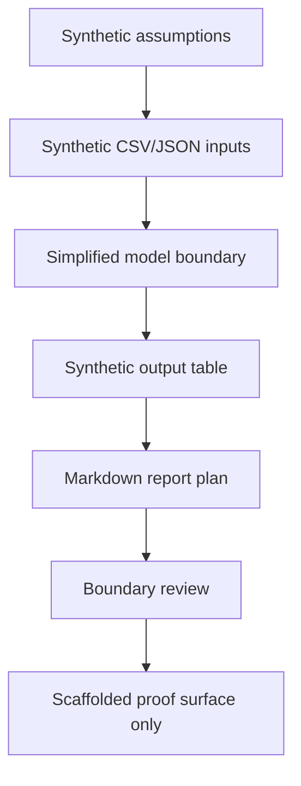

# Synthetic Thermal / Airflow / Power Study

Status: scaffolded

## Problem Statement

Public engineering simulation work needs a repeatable way to explain assumptions, model boundaries, synthetic inputs, synthetic outputs, validation questions, and non-proof limits before any result is treated as evidence.

This study asks: how can a synthetic infrastructure module be evaluated for thermal, airflow, and power margin using public-safe inputs while avoiding private measurements, production simulation data, benchmark claims, and physical-validation claims?

## Synthetic System Context

The study uses a fictional infrastructure service bay with generic equipment zones. The context is intentionally abstract:

- one synthetic heat-producing equipment group;
- one synthetic airflow support path;
- one synthetic power-capacity envelope;
- one operator review point;
- one validation report handoff.

No real facility layout, customer infrastructure, production thermal data, production airflow data, production power data, private workloads, endpoints, topology, credentials, or internal company product names are represented.

## Assumptions Table

| Assumption | Synthetic value | Source class | Review note |
| --- | --- |
| Heat load class | Low / medium / high qualitative bins | Synthetic/public-safe | Not a private measurement. |
| Airflow support class | Nominal synthetic airflow units | Synthetic/public-safe | Not production airflow data. |
| Power capacity class | Nominal synthetic capacity units | Synthetic/public-safe | Not production power data. |
| Control state | Observe, evaluate, review | Synthetic/public-safe | Not live control logic. |
| Output interpretation | Margin category only | Synthetic/public-safe | Not a benchmark or physical validation result. |

## Synthetic Input References

| Input | Purpose | Boundary |
| --- | --- | --- |
| `inputs/synthetic/thermal_airflow_power_inputs.csv` | Holds synthetic heat, airflow, and power-capacity units for scaffolded examples. | No private measurements or production simulation data. |
| `inputs/synthetic/control_state_inputs.json` | Describes synthetic observe/evaluate/review states. | No live control logic, endpoints, topology, or credentials. |

## Model Boundary

This model is a public-safe reasoning scaffold. It may show how to structure a simulation study, but it does not prove:

- physical thermal performance;
- airflow sufficiency in a real environment;
- power capacity for a real installation;
- benchmark standing;
- deployment readiness;
- certification readiness;
- product readiness.

The model intentionally avoids private traces, customer data, Foundation-private data, private measurements, production thermal data, production airflow data, production power data, private workloads, unreleased metrics, and unsupported result claims.

## Simplified Method

1. Read synthetic heat, airflow, and power-capacity classes.
2. Normalize each case into qualitative margin categories.
3. Flag any case that would need human review before becoming public proof.
4. Produce a synthetic output table and Markdown report plan.
5. Route all outputs through boundary review before profile or proof-stack use.

The method is descriptive and synthetic. It is not production simulation code and does not connect to live systems.

## Synthetic Output Table

| Case | Heat class | Airflow review | Power review | Synthetic margin category | Review state |
| --- | --- | --- | --- | --- | --- |
| synthetic_case_a | low | sufficient for scaffold | sufficient for scaffold | comfortable | scaffolded |
| synthetic_case_b | medium | review recommended | sufficient for scaffold | watch | scaffolded |
| synthetic_case_c | high | review required | review recommended | constrained | scaffolded |

These outputs are invented for method demonstration. They are not benchmark results, unreleased metrics, private measurements, or physical validation.

## Generated Report Plan

A generated report for this study should include:

- problem statement;
- synthetic context;
- assumptions table;
- input file references;
- simplified method;
- synthetic output table;
- model boundary;
- validation questions;
- what this proves;
- what this does not prove;
- public/private/sealed checklist;
- review state.

Reports must stay `scaffolded` until later human review approves a different status.

## Mermaid Validation Diagram

## Validation Questions

- Are all inputs synthetic or reviewed public-safe?
- Does the study avoid private traces, customer data, Foundation-private data, and private measurements?
- Does the study avoid production thermal data, production airflow data, production power data, and production simulation data?
- Are synthetic outputs clearly marked as non-benchmark and non-release material?
- Does the report avoid deployment, certification, physical-validation, product-readiness, released model, released dataset, Space release, and proof-completion claims?
- Is human review required before public routing?

## What This Proves

- A public-safe simulation study can be structured around assumptions, model limits, synthetic inputs, synthetic outputs, validation questions, and explicit review status.
- The repo can hold reusable documentation patterns for thermal, airflow, power, control, and system-level study scaffolds.
- Synthetic outputs can show method shape without exposing private or sealed material.

## What This Does Not Prove

- It does not prove physical performance.
- It does not prove benchmark standing.
- It does not prove deployment readiness.
- It does not prove certification readiness.
- It does not prove product readiness.
- It does not release a model, dataset, Space, or benchmark result.
- It does not validate a real customer, Foundation, company, or production system.

## Public / Private / Sealed Checklist

| Check | Status |
| --- | --- |
| Uses only synthetic/public-safe inputs | scaffolded |
| Excludes private traces | scaffolded |
| Excludes customer data | scaffolded |
| Excludes Foundation-private data | scaffolded |
| Excludes private measurements | scaffolded |
| Excludes production simulation data | scaffolded |
| Excludes production thermal, airflow, and power data | scaffolded |
| Excludes private workloads | scaffolded |
| Excludes endpoints, topology, and credentials | scaffolded |
| Excludes unreleased metrics and benchmark claims | scaffolded |
| Excludes model/dataset/Space release claims | scaffolded |
| Requires human review before public routing | scaffolded |

## Boundary

No private traces, customer data, Foundation-private data, unreleased benchmark results, private measurements, production thermal data, production airflow data, production power data, private workloads, internal company product names, sealed assumptions, deployment proof, certification claims, released model or dataset claims, or unsupported result claims are included.
